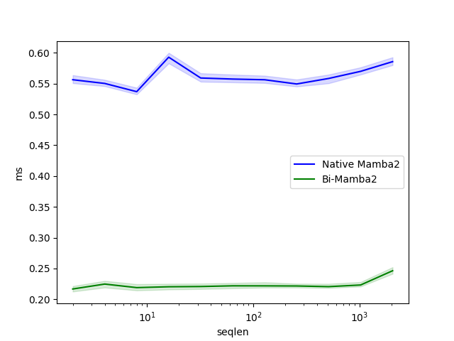
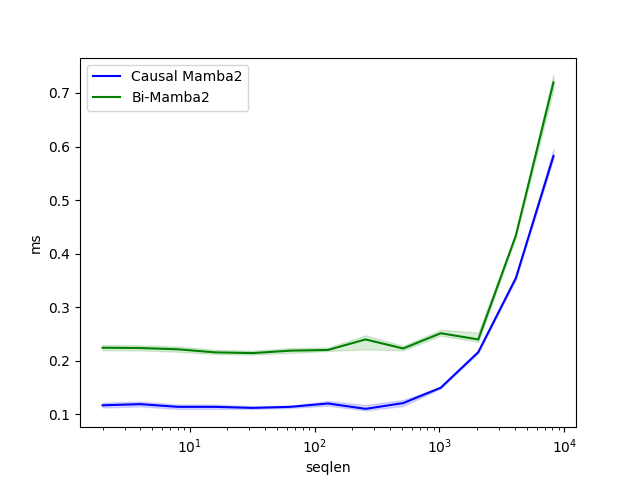

# A Bi-Directional Extension of Mamba2

Several works such as Hydra and MambaMixer have formulated bidirectionality through qusiseperable matrices. However, they often flip and rerun Mamba2's GPU kernel twice. This is too slow, and we can get a lot better performance if we fuse the kernel together. I edited the Triton Kernel from Mamba2 so that they are bidirectional. This will save both memory space and also time.

## NOTE

The fwd kernel is implemented, tested, and benchmarked. The bwd kernel is still in progress. I will remove this note when it's done.

# Project Structure and Install

To access the kernels, run:

```shell
pip install -e .
```
You can access the normal `ssd` kernels through `ssd.uni`. You can access the bidirectional kernels through `ssd.bi`.

## TODO:

- [x] Write FWD Implementation
- [x] Debug and Test FWD Implemntation
- [ ] Write BWD Implementation
- [ ] Debug and Test BWD Implementation

## Benchmarking

Comparing the Bi-Mamba2 optimized kernel, to the Naive approach of flipping and accumulating the sequence, we get the following.

<p align="center">
  
</p>

Furthermore, we can compare the cost of the Bi-Directional kernel to the causal kernel (i.e. the original Mamba2 kernel). At long sequence lengths, the Bi-Directional kernel has a very minor overhead compared to the causal kernel.

<p align="center">
  
</p>

The benchmarking was done on a 7900 XTX, and a 3970X Threadripper. The benchmarking code can be found in the `benchmark` folder. It can be run by using the following commmand:

```shell
python benchmark/benchmark_fwd_naive.py
```

## Tests

To run a test, simply use pytest along with the specific test file. For example, to run a test for the fwd pass of the kernel, use:

```shell
python -m pytest -x -s -v tests/test_fwd_scan.py::TestFwd
```
