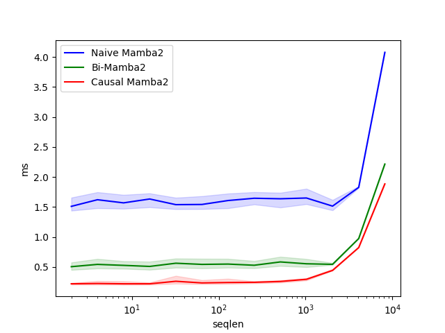

<h1 align="center" style="fontsize:50em"><b>A Bi-Directional Extension of Mamba2</b></h1>

Several works such as Hydra and MambaMixer have formulated bidirectionality through qusiseperable matrices. I highly recommend reading both of these papers to understand how bi-directionality can be done with Mamba. Unfortunately, neither implementation has an optimized kernel, which often increases the training and inference time by more than **2x**.

To overcome this issue, I wrote the following GPU kernel which both reduces the memory overhead and the latency. It does so by fusing kernels together to minimize the number of loads and stores from global memory.

# NOTE

Bwd is almost done, working on fixing final bugs with gradients. I will remove this note when completed.


# A Brief Overview of Bidirectionality in Mamba

The idea of bi-directionality is to formulate the "Attention Matrix" as a quasiseperable matrix, meaning that the matrix can be decomposed into two semiseperable matrices and a diagonal matrix. The formulation is still subquadratic, as both semiseperable matrices and the diagonal matrix can be computed linearly. Hydra formulates the quasiseperable matrix in the following format:

$$ y = shift(SS(x)) + flip(shift(SS(flip(x)))) + Dx $$

This kernel formulates the quasiseperable matrix as follows:

$$ y = SS(x) + flip(SS(flip(x))) + Dx $$

**Why?**: The main reasoning is simplicity. The shift operation adds a lot of complexity to the kernel, and furthermore, shifting in SRAM is not currently supported by Triton. As I don't want to rewrite the entire kernel in CUDA, I compromise with the above formulation.

# Project Structure and Install

### Installing Locally

To access the kernels, run:

```
pip install -e .
```

You can access the normal `ssd` kernels through `ssd.uni`. You can access the bidirectional kernels through `ssd.bi`.

### Installing with PyPi

Coming soon.

# TODO:

- [x] Write FWD Implementation
- [x] Debug and Test FWD implementation
- [x] Write BWD Implementation
- [ ] Debug and Test BWD Implementation
- [ ] Create PyPi Package
- [ ] Add more benchmarks

# Modules and API

There is two ways to access the Bi-directional kernel. The first is through the functional definition. For example, if you want to run a chunk-wise bi-directional selective scan, you can do so with the following snippet:

**Causal Kernel**

```python
from ssd import ssd_selective_scan

```

**Bi-Directional Kernel**

```python
from ssd import bi_ssd_selective_scan

```

Alternatively, you can also access it through a Module API, which is similar to a Mamba2 Layer:

**Causal Kernel**

```python
from ssd import Mamba2

model = Mamba2(
    # This module uses roughly 3 * expand * d_model^2 parameters
    d_model=dim, # Model dimension d_model
    d_state=64,  # SSM state expansion factor, typically 64 or 128
    d_conv=4,    # Local convolution width
    expand=2,    # Block expansion factor
    causal=True  # Will Default to causal=True, when not specified
).to("cuda")
y = model(x)
assert y.shape == x.shape
```

**Bi-Directional Kernel**

```python
from ssd import Mamba2

model = Mamba2(
    # This module uses roughly 3 * expand * d_model^2 parameters
    d_model=dim, # Model dimension d_model
    d_state=64,  # SSM state expansion factor, typically 64 or 128
    d_conv=4,    # Local convolution width
    expand=2,    # Block expansion factor
    causal=False # Will Default to causal=True, when not specified
).to("cuda")
y = model(x)
assert y.shape == x.shape
```

**Note** Currently using `seq_idx` like in Mamba2 causal is unsupported. Additionally `passing init_hidden_states` is also unsupported.

# Benchmarking

The benchmarking code can be found in the `benchmark` folder. It can be run by using the following command:

```
python benchmark/benchmark_fwd_naive.py
```

## AMD 7900 XTX and 3970X Threadripper

Comparison of fwd pass of Bi-Mamba2 v. Naive Flipping and Running Mamba2 kernel twice.
<p align="center">
  
</p>

Comparison of fwd pass of Bi-Mamba2 v. causal Mamba2.

<p align="center">
  
</p>

Comparison of bwd pass of Bi-Mamba2 v. Naive Flipping and Running Mamba2 kernel twice.

...

Comparison of bwd pass of Bi-Mamba2 v. causal Mamba2.

...

## 4060 Ti and Ryzen 9 8945HS

<p align="center">
  
</p>

## A100 40GB and Epyc 7763

Coming Soon

## H200 and Grace Chip

Coming Soon

# Tests

To run a test, simply use pytest along with the specific test file. For example, to run a test for the fwd pass of the kernel, use:

```
python -m pytest -x -s -v tests/test_fwd_scan.py::TestFwd
```

# Citation

If you find this kernel useful please cite Mamba, Hydra, and MambaMixer (They are amazing works!).

Give this repo a star also :)
